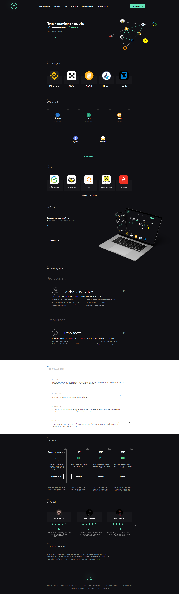

## Table of contents

- [Overview](#overview)
  - [The challenge](#the-challenge)
  - [Screenshot](#screenshot)
  - [Links](#links)
- [Author](#author)

## Overview

### Screenshot

### Links

- Live Site URL: [Add live site URL here](https://xareks.github.io/space_tourism/index.html)

### Built with

- Semantic HTML5 markup
- CSS custom properties
- Flexbox
- CSS Grid
- Mobile-first workflow
- gulp
- [Styled Components](https://styled-components.com/) - For styles

## Author

- github - 
- Frontend Mentor - [@Xareks](https://www.frontendmentor.io/profile/Xareks)
